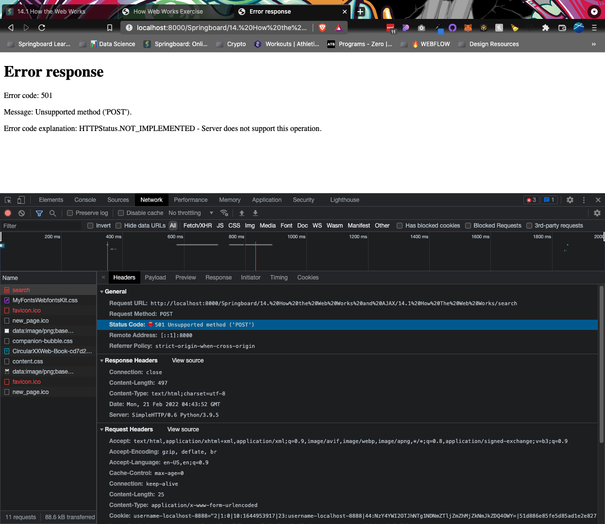

# How Web Works Exercise

## Part One: Solidify Terminology

[Click here to view answers to Part 1.](part-1-answers.md)

---

## Part Two: Practice Tools

1.  Using `curl`, make a `GET` request to the _icanhazdadjoke.com_ API to find all jokes involving the word “pirate”

    Answer:

    ```
    $ curl -H "Accept: application/json" "https://icanhazdadjoke.com/search?term=pirate"

    {
    	"current_page": 1,
    	"limit": 20,
    	"next_page": 1,
    	"previous_page": 1,
    	"results": [
    		{
    			"id": "2gii3LeN7Ed",
    			"joke": "Why couldn't the kid see the pirate movie? Because it was rated arrr!"
    		},
    		{
    			"id": "QuscibaMClb",
    			"joke": "What does a pirate pay for his corn? A buccaneer!"
    		},
    		{
    			"id": "SvzIBAQS0Dd",
    			"joke": "What did the pirate say on his 80th birthday? Aye Matey!"
    		},
    		{
    			"id": "exXSCtkOKe",
    			"joke": "Why do pirates not know the alphabet? They always get stuck at \"C\"."
    		},
    		{
    			"id": "SnOf2gqjiqc",
    			"joke": "Why are pirates called pirates? Because they arrr!"
    		}
    	],
    	"search_term": "pirate",
    	"status": 200,
    	"total_jokes": 5,
    	"total_pages": 1
    }

    ```

2.  Use `dig` to find what the IP address is for _icanhazdadjoke.com_

    Answer:

    ```
    $ dig icanhazdadjoke.com

    ; <<>> DiG 9.10.6 <<>> icanhazdadjoke.com
    ;; global options: +cmd
    ;; Got answer:
    ;; ->>HEADER<<- opcode: QUERY, status: NOERROR, id: 50400
    ;; flags: qr rd ra; QUERY: 1, ANSWER: 2, AUTHORITY: 0, ADDITIONAL: 1

    ;; OPT PSEUDOSECTION:
    ; EDNS: version: 0, flags:; udp: 8192
    ;; QUESTION SECTION:
    ;icanhazdadjoke.com.		IN	A

    ;; ANSWER SECTION:
    icanhazdadjoke.com.	300	IN	A	104.21.37.176
    icanhazdadjoke.com.	300	IN	A	172.67.211.64

    ;; Query time: 27 msec
    ;; SERVER: 2001:1998:f00:1::1#53(2001:1998:f00:1::1)
    ;; WHEN: Sun Feb 20 20:24:36 PST 2022
    ;; MSG SIZE  rcvd: 79
    ```

3.  Make a simple web page and serve it using `python3 -m http.server`. Visit the page in a browser.

    Answer:

    [HTML page](simple-page.html)

    

    ```
    $ python3 -m http.server

    Serving HTTP on :: port 8000 (http://[::]:8000/) ...
    ::1 - - [20/Feb/2022 20:35:14] "GET /Springboard/14.%20How%20the%20Web%20Works%20and%20AJAX/14.1%20How%20The%20Web%20Works/simple-page.html HTTP/1.1" 304 -
    ::1 - - [20/Feb/2022 20:35:14] code 404, message File not found
    ::1 - - [20/Feb/2022 20:35:14] "GET /Springboard/14.%20How%20the%20Web%20Works%20and%20AJAX/14.1%20How%20The%20Web%20Works/assets/css/style.css HTTP/1.1" 404 -
    ::1 - - [20/Feb/2022 20:35:14] code 404, message File not found
    ::1 - - [20/Feb/2022 20:35:14] "GET /favicon.ico HTTP/1.1" 404 -
    ::1 - - [20/Feb/2022 20:35:15] code 404, message File not found
    ::1 - - [20/Feb/2022 20:35:15] "GET /favicon.ico HTTP/1.1" 404 -
    ```

---

## Part Three: Explore Dev Tools

Build a very simple HTML form that uses the `GET` method (it can use the same page URL for the action) when the form is submitted.


Add a field or two to the form and, after submitting it, explore in Chrome Developer tools how you can view the request and response headers.


Edit the page to change the form type to `POST`, refresh in the browser and re-submit. Do you still see the field in the query string? Explore in Chrome how you can view the request and response headers, as well as the form data.



---

## Part Four: Explore the URL API

At times, it’s useful for your JavaScript to look at the URL of the browser window and change how the script works depending on parts of that (particularly the query string).

[Read about the URL API](https://developer.mozilla.org/en-US/docs/Web/API/URL)

Try some of the code examples in the Chrome Console so that you can get comfortable with the basic methods and properties for instances of the URL class.
